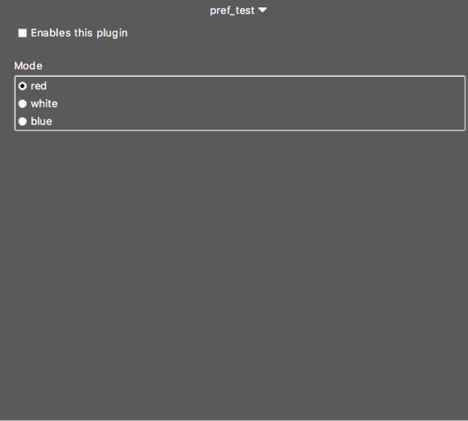

## do\_pref\_ui

#### Description

The “do\_pref\_ui” action is called when the preferences window needs to build the preference panel for the plugin. The procedure called by this action is responsible for generating the plugin’s preference UI which is primarily performed using the api\::preferences\::widget and container widgets such as ttk\::frame, ttk\::labelframe, ttk\::panedwindow and ttk\::notebook.

#### Tcl Registration

`{do_pref_ui do_procedure}`

#### Tcl Procedures

**The “do” Procedure**

This procedure is responsible for creating and arranging the various GUI widgets that control the layout of the plugin’s preferences panel.  The following is a representation of what the body of the procedure might look like:

```Tcl
proc do_pref_ui {w} {

  api::preferences::widget checkbutton $w "Enable" "Enables this plugin”
  api::preferences::widget spacer $w

  pack [ttk::labelframe $w.lf -text "Color"] -fill x
  
  api::preferences::widget radiobutton $w.lf "Color" "red" -value “red”
  api::preferences::widget radiobutton $w.lf "Color" "white" -value “white”
  api::preferences::widget radiobutton $w.lf "Color" "blue" -value “blue”
  
}
```

This plugin creates a check button which allows the “Enable” preference item to be set. It also adds three radio buttons which allow the user to select one of three colors to set the “Color” preference item. The three radio buttons are placed into a ttk\::labelframe container widget. Between the check button and the radio buttons is vertical space. This code will result in a preference panel that will look something like the following:



If the do\_pref\_ui procedure creates any widgets outside of those provided for in the api\::preferences\::widget API procedure, it is the responsibility of the do\_pref\_ui procedure to handle packing. All widgets created with the api\::preferences\::widget API procedure will pack themselves in the order they are created, using either pack (default) or grid (using the -grid 1 option to api\::preferences\::widget). See the api\::preferences\::widget description for a full explanation of the available widgets that can be created with that procedure.
