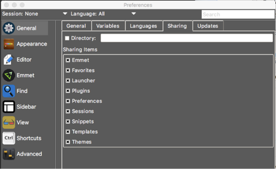

### Changing Sharing Setup via Preferences GUI

Application data sharing options can be changed at any time within TKE using the preferences GUI.  Start the preferences GUI using the “Edit / Preferences / Edit User - Global” menu option.  This will display the preferences GUI.  Make sure the “General” panel is selected on the right side of the preferences window and select the “Sharing” tab in the options panel.  The following image is a depiction of this preference panel:

The Sharing panel displays the location of the share directory.  If the field is empty, the checkbox will be unchecked.  If the share directory is cleared, the application data is being stored in the user’s local .tke directory within their home directory and the selected items in the “Sharing Items” list are unused.  If the shared directory is specified, the “Sharing Items” list specifies which application data are stored in the shared directory (selected) and which are stored locally (unselected).

If the shared directory is empty and you would like to cause your application data to be stored in a shared directory, click on the checkbox to the right of the directory name.  This will display a directory chooser window.  If a directory is selected, its pathname will be displayed in the directory field.  When the preferences window is closed, the sharing changes will be applied.

If the sharing directory was changed from local to shared, TKE will copy any local files/directories that were selected for sharing to the shared directory if those files/directories do not currently exist in the shared directory.  If the sharing directory was changed from shared to local, TKE will copy the selected shared items from the sharing directory to the local directory, overriding any files/directories in the local directory.
