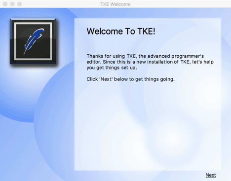
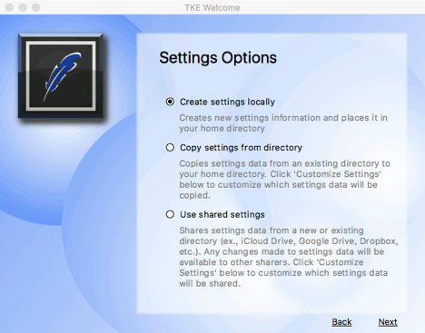
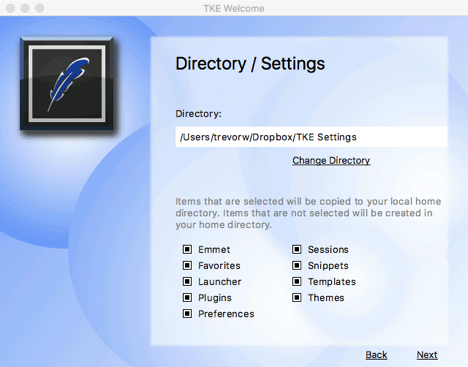
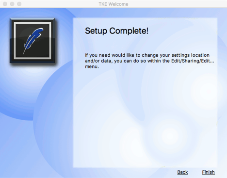

### Setting Up On First Install

After TKE is installed on a system, if the .tke directory in the user’s home directory does not exist, TKE will display a first start wizard to aid the user in setting up the location of the application data prior to starting the application.  The wizard is made up of four screens:

- Welcome screen
- Application data directory selector
- Share/Import directory and item selector
- Finish screen

These screens are shown below:

This screen allows the user to specify where the application data should be stored.  If the “Create settings locally” option is selected all application data will be stored in the \~/.tke home directory (i.e., no items will be shared).  If the “Copy settings from directory” option is selected, the user will be asked for the location of a directory containing existing application data which will be copied to the user’s \~/.tke home directory.  If the “Use shared settings” option is selected, the user will be asked to specify a directory location to share application data.  After selecting an option, click the “Next” button to continue.

This screen will display the selected directory if either the import or share options were selected on the previous screen.  You can change the directory by clicking on the “Change Directory” button.  At the bottom of the screen is the list of application data items to import/share.  If the user is doing an import, all selected items in the list will be copied to the user’s .tke home directory (if that application data is available in the selected directory).  If the user is sharing data, all selected items will be shared with other computers in the specified directory.  All unselected items will be placed in the user’s .tke home directory.  Click “Next” after all items are filled out as desired.  Click the “Back” button to return to the previous screen.

This screen just reminds the user that they can always change their settings from with TKE.  Click on the “Finish” button will perform the application data setup and will start the application for use.  Click on the “Back” button to return to the previous screen.
