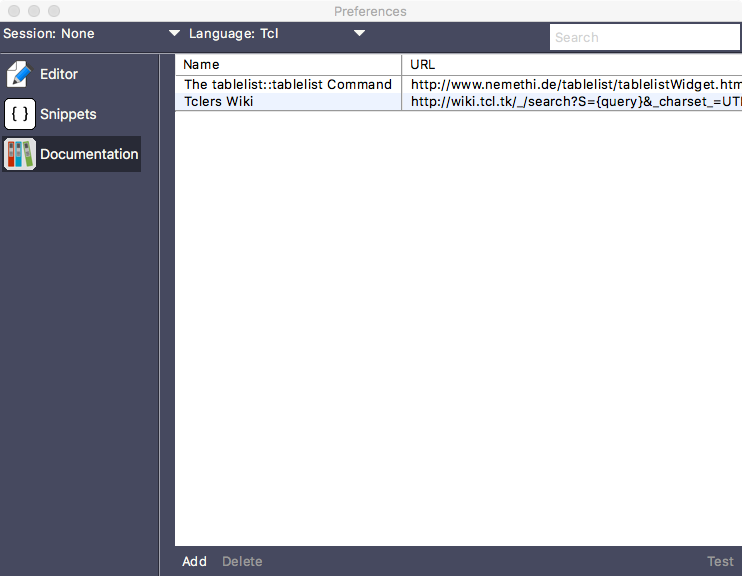

## Editing Language References

Each syntax description file that comes pre-installed with TKE contains at least one website containing the language reference manual for the given syntax language. Though it is not possible to edit this website location, TKE does provide the user the ability to enter in their own websites from within the documentation preference panel.

To add, remove or edit language references, select the `Edit / Preferences / Edit Language - Global` menu option. This will display the preferences window for the current language’s syntax. In the sidebar, clicking on the `Documentation` tab will display the language reference editor. A representation of this panel is shown below.

To add a new website, click on the `Add` button. This will display a dialog box prompting you to enter the URL of the website to add. After entering a valid URL and clicking on either the `Add` button or hitting the Return key, TKE will lookup the website and, if valid, will grab the title of the found webpage, use the title as the default name to add and then add that webpage to the documentation table.

To create a website that can be searchable, simply add the string `{query}` within the URL at the location where the search string would be placed. TKE will search for this substring within each URL. Any website that is missing this string will be displayed in the `Help / Language References` submenu while all URLs that contain this substring will be displayed in the reference search panel. When a searchable URL is used, TKE will will replace this substring with the text to search for, substituting any characters in the search string with the appropriate web safe URL characters.

You can edit any entry in the table by selecting the line and then clicking on the name or URL fields. This will put the field into edit mode. Make the appropriate changes and hit the Return key to commit the change.

To remove a line from the table, select the line and click on the `Delete` button.

You can also re-order the webpages by selecting a row in the table and then dragging and dropping the row in a different location in the table. The order that the rows are displayed in the table will be the order in which these names will be displayed in the `Help / Language References` submenu as well as the menu popup within the reference search panel.

To test the validity of a website in the table, select the table and click on the `Test` button. TKE will open your default web browser with the associated URL.