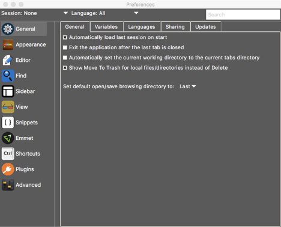

## Editing Preference Information

The GUI preference window contains three main panes depicted in the following image.

At the top of the preference window is an area which allows you to select which preference types to modify. The **Session** menu button allows you to select whether you are editing the general user preferences (using the value of “None”) or preferences for a specific existing session. To change the main preference setting, simply click on the menu button and select the desired option. The **Language** menu button allows you to specify the preferences for any tabs opened with a specific language. Selecting a value of “All” will edit preferences that will be true for any language; however, selecting a language will display and save preference settings for the specific language chosen. Note that the session and language menu buttons are used in concert with each other to set the specified setting.

On the right side of the top panel is the search entry field. Use this field to quickly find a given preference value within any valid category pane in the GUI. The search value can be any set of printable characters where a ‘\*’ can serve as a wildcard character or set of characters. All matching search results will be immediately displayed and updated while typing just below the search field. In addition, the category tabs in the left sidebar will be highlighted showing which tabs contain matches to the current search string. Selecting a match from the match list will immediately change the preference GUI to display the pane containing the preference item.

On the left side of the preference GUI is the preference category sidebar. This sidebar contains the list of available preferences for the currently selected session/language preference item displayed at the top of the window. Click on a category to display the associated preference pane in the area to the right of the sidebar.

The main area to the right of the sidebar is the preference pane area. In this area, all available preference items associated with the currently selected preference category will be displayed. In some categories, the preference pane will be further broken down into subcategories using a simple tabbed interface towards the top of the preference pane. Clicking on a tab will display the preference items associated with the subcategory.

It is important to note that depending on the session/language setting, the available preference categories may change. Generally, the following are true:

- All available categories will be displayed when the session is set to “None” and the language is set to “All”. This is the general user settings.
- If the session is set to a non-“None” value and the language is set to “All”, the “General” and “Advanced” categories will not be available for modification.
- If the language is set to a non-“All” value, only the “Editor” category will be displayed in the UI. This is accomplished by hiding the sidebar and using the entire lower portion of the window for editor preference display.

Any change made within the preferences window will be immediately applied/saved. When you are finished making preference changes, close the window using the window manager close option.
