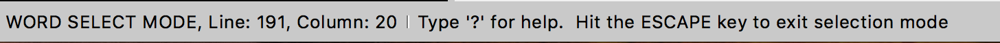

#Select Mode

New in TKE starting with version 3.4 is a feature called "Select Mode" which allows you to perform powerful, fine-grained selection using only the keyboard. This is accomplished by entering a temporary keyboard input mode (similar to how Vim mode works). When we are in select mode, key presses will change the result of the selection instead of interpreting those keypresses as characters to be entered into the editing buffer.

When you enter selection mode (with the `Edit / Select Mode` menu option), bottom left corner of the application window will specify that we are in that mode. Likewise, when you exit select mode, the status information will be cleared in the information bar. In addition to the mode changing, the information bar will display some information to provide the keypress to display the command help panel and to exit selection mode.

