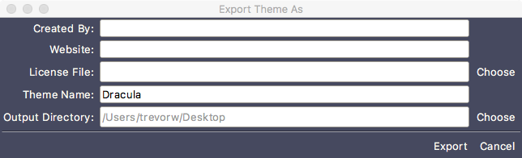

#### Button Action Bar

At the bottom of the theme editor window is the button action bar. This area displays the UI buttons and other widgets used for opening themes for edit, saving theme changes, creating new themes, importing themes into TKE, exporting themes from TKE (for the purposes of sharing themes with other users), and previewing theme changes within the current TKE session.

The displayed content in this area is contextually aware. By default, the main open/preview/save button bar is displayed.

To open another theme for editing or import a theme into TKE, click on the “Open” button. This will change the button bar to the open/import button bar.

To import a .tkethemz theme file (TKE theme file package) or a .tmtheme (TextMate theme file), click on the “Import” button. This will display a file picker window. Find the desired theme file and click on the “Open” button. This will install the theme into the user’s theme directory (located in
\~/.tke/themes) and immediately display the theme in the theme editor. Doing this will also redisplay the open/preview/save button bar.

To open a different theme for editing, click on the “Choose Theme” button. This will display a list of installed themes. Selecting a theme from this list will display the theme contents in the theme editor and automatically preview them in the current TKE session. The import/open button bar will remain visible, allowing you to quickly open theme after theme without extra clicks. When you are done using the import/open button bar, you can either click the “Done” button or simply make a change to any part of the opened theme. Both actions will dismiss the import/open button bar and display the open/preview/save button bar.

When you want to see a live preview of the current theme changes in the current TKE session, click on the “Preview” button in the open/preview/save button bar. After a second or two, the current TKE session will be updated with the theme edits made in the theme editor (whether the changes have been saved or not).

If you want to save the current theme changes under a new theme name, left-click on the “Save” button. This will display the export/save button bar. You can change the name of the theme in the name entry field. If you are a TKE developer, a directory selection button will allow you to specify whether the theme should be saved in the TKE installation directory or the user’s theme directory. If you are not a developer, all new themes will be saved in the user’s theme directory. Clicking on the “Save” button will save the changes to the new theme and redisplay the open/preview/save button bar. Clicking on the “Cancel” button in the export/save button bar will cancel the theme creation and redisplay the open/preview/save button bar.

If you want to save the changes back to the current theme, either left-click on the “Save” button in the open/preview/save button bar and then click the “Save” button in the export/save button bar or, even more simply, right-click on the “Save” button in the open/preview/save button bar which will immediately save the changes to the current theme file without changing the button bar state.

To export the current theme to a theme package which can be shared with and imported by other TKE users, click the “Save” button in the open/preview/save button bar and then click the “Export” button. This will display a popup window which is represented in the following image.

The first three entries allow the user to enter attribution and license file information. The attribution information will be displayed in the title bar of the theme editor when a user imports the theme and views it within the theme editor. The license file will be bundled with the rest of the theme information and copied to the theme directory when it is imported by the user. All three fields are optional, but it is encouraged that at least the “Created By” field is filled in.

The last two fields contain the name of the theme being exported. By default, this field will be filled in with the current theme name being edited in the theme editor; however, you can change this name to be anything you want though short, memorable, unique names are preferable. The theme name is not optional. If no theme name is specified, the “Export” button at the bottom of the window will be disabled. The “Output Directory” field specified the name of the directory that will contain the exported theme package. The field is not editable; however, you can select a directory by clicking on the “Choose” button to the right of the display field. This field is also mandatory. Once the contents of this window have been properly filled out such that the “Export” button is clickable, clicking this button will dismiss the window and create the theme package file in the specified directory. The theme package file is a zipped file that can be shared in any method necessary with other users. You can install a TKE theme package by using the import functionality of the theme editor as described above, or, on Mac OS X, by dragging and dropping the file on the TKE application icon.