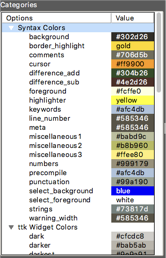

#### Category Table

The category table is displayed on the left side of the window and displays all of the UI elements that can be customized as part of the theme. They are organized in the table by category. Left-clicking on the disclosure triangle of the category will show/hide all options within the category. Left-clicking on a category option row will select the row and display the associated option information in the option detail pane which allows the options value to be changed. Each category option displays the name of the option as well as displays the current value (and potential representation of the value, if possible).

There are a few operations that can be performed on the category table which are accessible by left-clicking on the header of the table. This will display a menu containing the following features:

##### Category Table Search

To help find a specific category option, the category table provides a simple search mechanism. Clicking on the **Table Search** option will display the search entry field just above the category table. Entering text in this field will modify the displayed category options that match the current search string. If you hit the **Return** key while entering text, the current text will be selected. If text is selected, entering an additional character will delete the search string and replace it with the entered character. If you hit the **Escape** key, the search field will be closed and all options in the category table will be displayed. You can also select the **Table Search** option in the table menu a second time to hide the search field as well.

##### Category Table Filtering

To help make viewing or searching for items in the category table simpler, it also provides for some basic filtering functionality. The filter submenu contains the following filtering capabilities:

| Menu Item | Description |
| - | - |
| Show All | Displays all items in the table. This filtering option is useful when the table is hiding information from a previously applied filter. |
| Show Category | Displays a submenu containing a list of all theme categories. Selecting a category in this list will hide all other categories and display only the selected category. |
| Show Color | Displays a submenu containing a list of all colors assigned to UI elements within the theme. The first colors displayed will be the swatch colors, followed by a menu separator, followed by all other colors. Selecting a color will display only those options whose color matches the chosen color. |
| Show Selected | Value This option will only be valid when an option row is selected in the category table. All options in the table that have a value that match the selected row’s value will be displayed. |
| Show Selected | Option This option will only be valid when an option row is selected in the category table. All options in the table that have the same option name as the selected row will be displayed. |

##### Category Table Copy/Paste

To help make creating new themes easier, the theme editor also allows you to copy multiple theme options from one or more themes (all options are appended to the theme copy buffer) and consequently paste those options into a new theme.

To copy items, you will need to put the category table into copy mode by selecting the category table menu’s **Enable Copy Mode** option. Selecting this option will display two buttons below the category table: **Copy** and **Close**. Once the table is in copy mode, you can select/deselect options by left-clicking on the option. Additionally, you can select/deselect an entire category’s options by left-clicking on the category row in the table. Once you have the options selected that you want to copy, clock on the **Copy** button to add these to the theme copy buffer (this buffer is separate from the clipboard). You can continue to select and copy in the same manner. When you are done copying items in the category table, click on the **Close** button to exit copy mode and return the table to normal operation.

To paste the current theme copy buffer to a theme, open the theme and choose the **Paste Theme Items** option in the category menu. This will update the current theme options and empty the theme copy buffer. You can also empty the theme copy buffer by closing the theme editor and redisplaying it.
