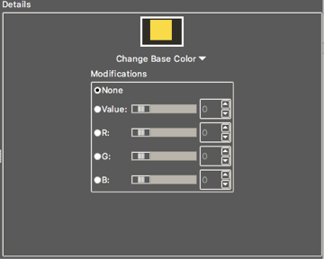
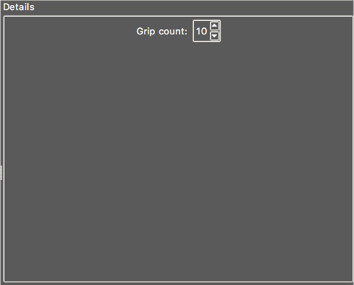
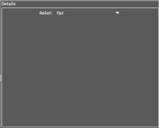
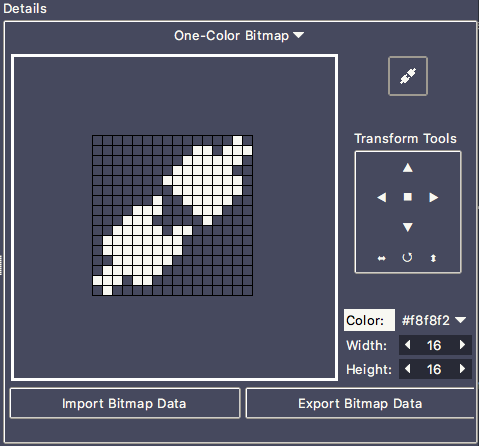
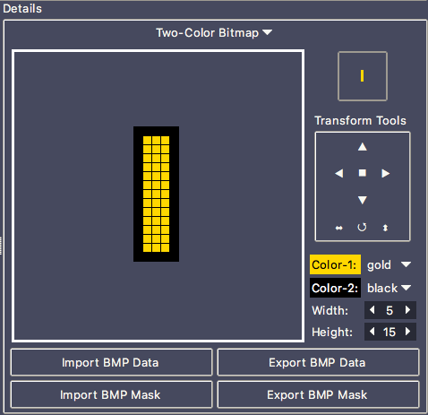
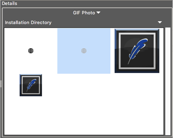

#### Option Detail Pane

The option detail pane displays the option editor UI for the selected row in the category table. Any changes made within this pane will be immediately reflected in the category table. The detail pane will change its UI dependent upon the type of option being edited. Currently, there are 4 types of options can be changed:

1. Color
2. Number
3. Relief
4. Image

Each detail pane type is described in the following subsections.

##### Color

The color pane allows for editing a single color by either selecting a color through a standard color chooser, selecting a swatch color and, optionally, modifying the selected color with some simple modifications. A representation of the color pane is shown below.

The top image shows two colors. The background color is the base color that the given color will surrounded by. Showing the base color along with the color being edited should help in choosing an appropriate color. The foreground color is the color being selected.

Below the color preview is the main color chooser. Left-clicking the button will allow you to either select a color with a standard color picker or select one of the swatch colors.

Below the color picker is the color modification panel. Choosing the “None” option will use the color as is. Choosing the “Value” option will change the current color’s HSV value by the given number. You can change this value by either using the slider, editing the value in the entry field or using the up/down buttons. As you change this value, the foreground preview color will display two colors. The color on the left is the selected color, the color on the right is the color with the modification applied (the actual color that will be used). The “R”, “G”, or “B” options, if selected, will change the color by the specified color value. You can only use one modification on the selected color. You are not permitted to combine modifications.

Any color changes made in this pane will be immediately reflected in the category option table.

##### Number

The number pane allows you to modify the value of an option that has a numerical value. You can modify the value using the entry field and/or up/down arrows. Any changed made in this pane will be immediately reflected in the category option table. A representation of the number pane is displayed below.

##### Relief

The relief pane displays a drop-down list allowing you to select from the available relief values. Any changes made will be immediately reflected in the category option table. A representation of this window is shown below.

##### Image

The image pane is a powerful way to create and edit one or two-color bitmaps, or select a GIF image to use for a given UI image. The top-most selection menu allows you to switch between these three image editors.

**Single-Color Bitmap Editor**

The one-color bitmap editor creates a simple bitmap image that can contain one color. Any uncolored pixels will be transparent, taking on the background color of the window behind the image. To help represent what the image will look like, the background color of the editor and image preview area match the actual background color of the window. The following is a representation of the single-color bitmap editor.

On the left side of the pane is the bitmap editor. The grid of squares represents the pixels in the bitmap image. To set a pixel, simply left-click on the given pixel. To make the pixel transparent, simply left-click on a given pixel that is set.

On the right top is a preview of the image shown in actual size. Below the preview is the color chooser which allows you to change the color used in the image. You can select a color via a standard color chooser or you can select a color swatch value. Below the color picker are selection tools for setting the pixel width and height of the image.

If you already have a BMP file containing the image, you can click the “Import BMP Data” button, select the file in the file chooser, and the bitmap image will be displayed in the selected color.

**Two-Color Bitmap Editor**

The two-color bitmap editor is much like the single-color bitmap editor except that the bitmap image is made up of two colors with any uncolored pixels being transparent. The following is a representation of this window.

On the left side, is the image editor. To set a pixel to a given color (or make it transparent), left or right-click on a pixel to change the pixel’s display.

The image preview is shown in the upper right-hand corner in actual size. Below this preview are two color choosers to select the first and second colors of the image. With the color choosers, you can select a color via a standard color picker or use one of the swatch colors. Beneath the color selectors, are widgets to change the height and width of the image.

If you already have a BMP image in a file, you can click on the “Import BMP Data” or “Import BMP Mask” buttons will set the image’s bitmap data or bitmap mask fields to the given value. The mask defines which pixels are drawn and which are transparent. The data defines which pixels are drawn in the first (pixel set) and second (pixel clear) colors.

**GIF Photo**

The GIF photo browser allows the user to choose an existing GIF photo image from either the installed image directory, the user’s theme directory or an existing file on the file system. In the latter case, the image will be copied to the user’s theme directory when the theme is saved so that the image can be used even if the original copy is moved or discarded. The following image is a representation of this window.

At the top of the pane is a directory chooser for selecting an image. Three options are provided: installation directory (the image directory in the installed version of TKE), the user directory (user-owned directory in \~/.tke/themes) that contains the current theme data and related images, or choose a directory from anywhere in the filesystem. When an option is selected, any files with a .gif extension will be displayed in the grid view below.

The grid view shows previews of the available images. The background color of the grid will match the background color that the image will be displayed onto. To select an image to use, simply select it with the mouse. This will immediately update the image in the category option table.

