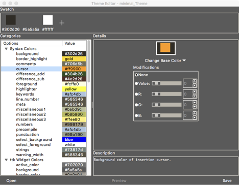

## Theme Editor

The Theme Editor is a GUI interface for creating, editing, importing and/or exporting themes within TKE. To access the theme editor, select the “Tools / Theme Editor” menu command. The window displays a preview of the syntax highlighting scheme in a sample window. The following image is a representation of this window.

