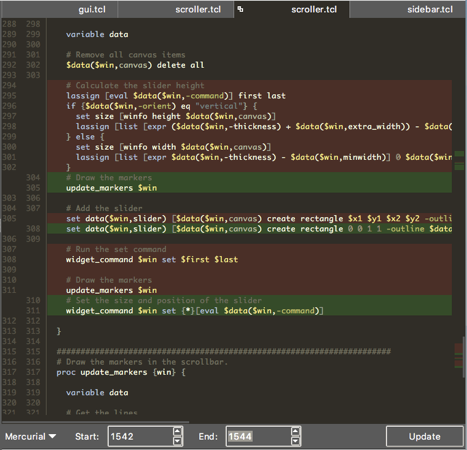

# Difference Viewer

When a file is displayed in the editor, the “Show File Difference” option in the File menu will create a new tab in the editor with the file shown in “Difference View”.  This view is somewhat different than when a file is in edit mode.  The purpose of this view is to allow the user to visually see file differences between two versions of the same file (available from a version control system like Mercurial, Git, Bazaar, Subversion or Perforce), between two different files (using the Posix standard diff utility), or using output from a customized command that produces unified difference output.

The following image shows what a difference view looks like.

The window is comprised of 4 main parts:

- Line number bar (left)
- Main file viewing area (middle)
- Difference map (right)
- Control panel (bottom)
