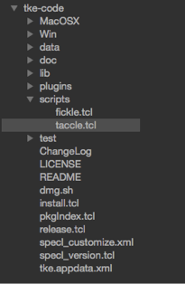

### Files

Files have different functions available to them than directories.  Double-clicking any file will open the file in the editor.

The following image depicts the sidebar with a file highlighted.

The following table lists the available functions for files.

| Menu Item | Description |
| - | - |
| Open | Opens the selected file in the editor.  An opened file will have a color applied to its background to make it easy to identify opened files in the sidebar. |
| Close | Closes the selected file in the editor.  If the file has been modified, a prompt will be displayed asking if the changes should be saved or not. |
| Hide | Hides the tab of the selected file in the tabbar. |
| Show | Unhides the tab of the selected file in the tabbar. |
| Show Difference | Displays a difference view of the currently selected file. |
| Copy Pathname | Copies the selected file pathname to the clipboard. |
| Rename | Renames the selected file in the file system.  The current full pathname will be specified in an entry field at the bottom of the application window.  Once filename editing is complete, hit the RETURN key to cause the rename to occur.  Hit the ESCAPE key to cancel the renaming operation. |
| Duplicate | Will create a duplicate file of the selected file in the same directory.  The file will be named with a unique name and will be editable.  Use the ‘Rename’ command to change the name, if necessary. |
| Delete | Deletes the file from the filesystem and removes the file from the sidebar.  If this item is selected, an affirmation prompt will be displayed to confirm or cancel the deletion. This option will be displayed if the “Use Move to Trash” general preference option is unset. |
| Move to trash | Moves the selected files to the trash. No user prompt will be displayed to confirm the request. This option will only be displayed if the “Use Move to Trash” general preference option is set. |
| Favorite/Unfavorite | Marks the selected file to be a favorite (if the Favorite command is selected) or removes it from the favorites list (if the Unfavorite command is selected).  Favorited files can be quickly opened in the editor via the File / Open Favorite menu or the command launcher.

After these functions will be listed any file popup menu items that are added via plugins.  See the Plugins and Plugin Development chapters for how to create these plugin types.
