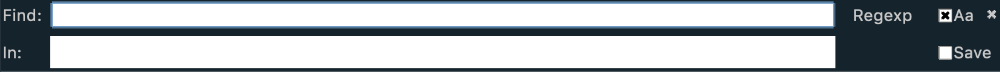

### Find in Files

When the user performs a “Find in Files”, a special tab will be added to the editing pane.  This file will contain snippets of lines of text from all files that have matches to the search text.  Within the window, all matching text will be highlighted the same yellow that is used for normal searching.  If the user left clicks or hits the space bar when the insertion cursor is within on any matching text within this tab, the corresponding file will automatically be added to the editing pane as a new tab and the insertion cursor will be placed at the beginning of the matching text in the file.  This allows you to quickly find and get to the matches within the editor.

To perform a "Find in Files" operation, select the "Find / Find in Files" menu option. The resulting panel will be displayed.

The "Find" entry field allows you to express the text string to search for. This string can be valid regular expression. Hitting the up/down keys in this field will traverse the previous search history for this panel.

The "In" field allows you to enter one or more files/directories to search within. After entering the file/directory name, hit the enter key to transform the text into a token. You may enter as many search tokens as you need in this field. You can delete tokens by either hitting the Backspace key or by selecting a token with the mouse and hitting the Backspace key. You may also drag and drop files into this field to add those to the list of files to search. Finally, you may enter the following special strings:

- "Opened Directories" = Adds all of displayed files in the sidebar to the list of files to search.
- "Opened Files" = Adds all of the files that are opened in editing buffers to the list of files to search.
- "Current Directory" = Adds all of the files in the current working directory to the list of files to search.

The "Aa" checkbox specifies if case-sensitive matching should be used (checked) or not (unchecked).

The "Save" checkbox will remember the given search criteria and save it in the search history which will be available between application sessions.

The "x" button on the right will close the panel. You can also exit the panel without performing a search by entering the Escape key when the panel has input focus.

To execute the search, simply hit the Enter key after both the "Find" and "In" fields contain their respective search information.