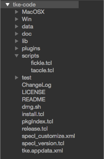

### Root Directory

A root directory in the sidebar is any directory that doesn’t have a parent directory immediately shown in the sidebar.  You may have more than root directory listed in the sidebar.  To view the full pathname of a root directory, hover the cursor over the directory name until the tooltip appears.

The following image is a depiction of the sidebar with the root directory highlighted.

The following table lists the available contextual menu functions available for root directories.

| Menu Item | Description |
| - | - |
| New File | Adds a new file to the root directory.  If this menu item is selected, an entry field at the bottom of the window displayed, allowing the user to specify a filename for the new file.  Entering a name and hitting the RETURN key will create the new file in the directory and open the file in the editor. |
| New File From Template | Opens a new file to the selected directory in an editing buffer. A prompt for a filename will be displayed at the bottom of the main window. After a name is entered and the RETURN key pressed, a list of available templates will be displayed. Selecting a template will create the new tab, insert the text, and perform any snippet substitutions. |
| New Directory | Adds a new directory to the root directory.  If this menu item is selected, an entry field at the bottom of the window is displayed, allowing the user to specify a name for the directory.  Entering a name and hitting the RETURN key will create the new directory. |
| Open Directory Files | Opens all shown files that are within the directory. |
| Close Directory Files | All open files in the editor that exist within the root directory and below it will be closed.  Any files which require a save will prompt the user to save or discard the file modifications. |
| Disconnect From Server | This option will only be displayed for root directories that exist on a remote server.  Selecting this item will automatically remove the associated directory hierarchy from the sidebar, close all files and disconnect the associated FTP/SFTP/WebDAV connection. |
| Hide Directory Files | Hides the tabs of any opened files in this directory in the tabbar.  Useful for focused workflows. |
| Show Directory Files | Shows any hidden tabs of opened files within the selected directory. |
| Copy Pathname | Copies the pathname of the selected root directory to the clipboard. |
| Rename | Renames the root directory in the file system.  The current full pathname will be specified in an entry field at the bottom of the application window.  Once filename editing is complete, hit the RETURN key to cause the rename to occur.  Hit the ESCAPE key to cancel the renaming operation. |
| Delete | Deletes the root directory from the filesystem and removes the directory from the sidebar.  If this item is selected, an affirmation prompt will be displayed to confirm or cancel the deletion. This option will be displayed if the “Use Move to Trash” general preference option is unset. |
| Move to trash | Moves the selected directories to the file system’s trash. Directories will be moved without a user prompt. This option will be displayed if the “Use Move to Trash” general preference option is set. |
| Favorite/Unfavorite | Marks the selected directory to be a favorite (if the Favorite command is selected) or removes it from the favorites list (if the Unfavorite command is selected).  Favorited directories can be quickly added to the sidebar via the File / Open Favorite menu or the command launcher. |
| Remove from Sidebar | Removes the root directory from the sidebar (no modification to the file system will take place).  If this item is selected, the entire root directory is removed from the sidebar. |
| Add Parent Directory | Adds the parent directory in the filesystem of the root directory.  The current root directory will no longer be a root directory (replaced by the parent directory) but will become a standard directory underneath the parent. |
| Make Current Working Directory | Changes the current working directory to the root directory.  Selecting this item will make all file operations within the editor relative to the selected directory.  Additionally, the working directory information in the title bar will be updated to match this directory. |
| Refresh Directory Files | Updates the sidebar contents for the root directory. |

In addition to these functions, plugins can also add functionality beneath these items in the menu.  See the Plugins and Plugin Development chapters for more information.
