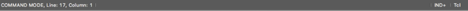

## Status Bar

The status bar is the area located at the bottom of the application window.  It’s function is to display the following information to the user.

- Vim mode (if the editor is currently in Vim mode).
- Vim macro recording mode (only displayed when recording and includes the name of the buffer being recorded to).
- Current row and column position of cursor within the current editor.
- Informational, temporal messages provided by the application.
- Current mode of auto-insert for the current editor (includes ability to change the indentation mode for the current editor).
- Display current syntax applied to current editor (and ability to change that language).

The following image is a representation of the status bar.

