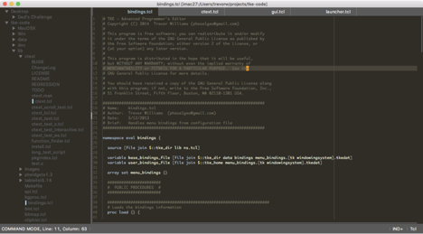

# User Interface

By default, the editing environment consists of two panels: a file/directory sidebar and the tab-controlled editing buffer itself.  As much as it possible, busy and redundant UI elements are removed from the screen when they are not in use.  Most of the UI is only displayed as needed when the user calls up its functionality.

